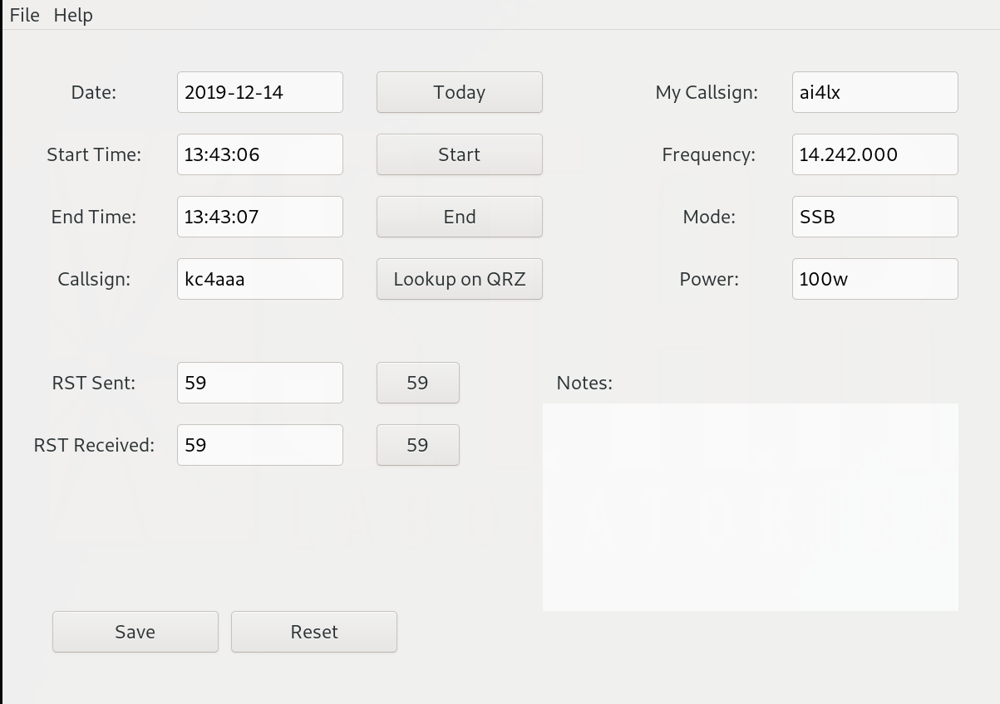

# Ham Radio Logger

This is a very new project.  The goal is to write a simple yet powerful ham
radio logger application.  There are a few others out there, but this one will
be more customized to do exactly what I want.

## TODO:

* Add input sanitizing/checks
* Switch from localtime to UTC
* Set a default database
* Clean up database when switching to new database
* Fix notes input
* Add logbook view window
* Add window to list past contacts with callsign
* Add Bands for frequencies
* Set up default entries 
* Start work on Help documents and About page
* Set up exports for various output/contest formats
* Add contest options(?)
* Add licensing stuff (GPL,MIT,...?)
* Probably lots of other stuff....
* Actually get back on the radio and use this...
